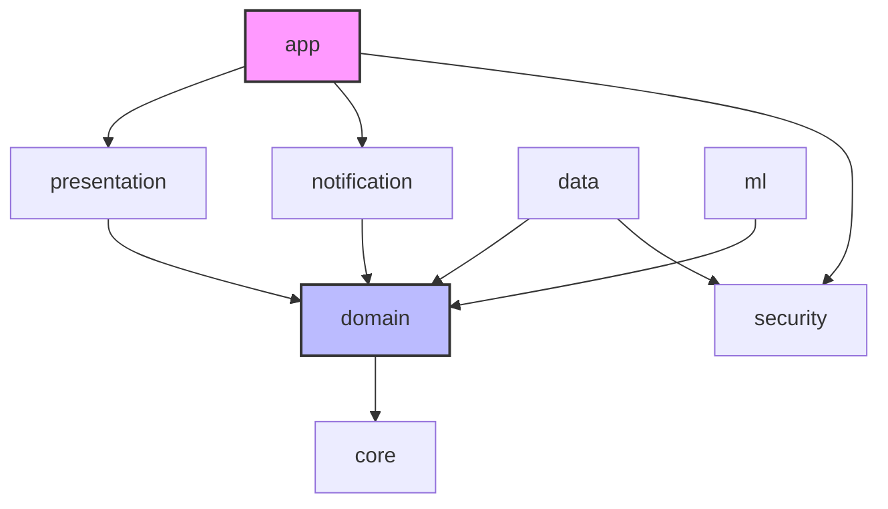

# Digital Communication Safeguard (DCS)

Digital Communication Safeguard (DCS) is a production-quality, 100% offline, privacy-first Android application designed to detect scams, phishing attempts, and abusive messages in real-time. By intercepting notifications, it processes text locally using on-device machine learning (TensorFlow Lite) and custom rule-based heuristics, warning users instantly via interactive overlays.

The application is specifically optimized for both **English** and **Tanglish** (Tamil written in Latin script), protecting users against localized messaging threats.

---

## Key Features

- **100% Offline & Private**: Zero internet permissions (`android.permission.INTERNET` is completely absent from the manifest). All processing is done locally on the device.
- **On-Device ML Inference**: Powered by a custom-trained TensorFlow Lite model (`threat_detector.tflite`) paired with a heuristic Rule Engine and Risk Fusion Engine.
- **Tanglish & English Normalization**: Advanced preprocessing that translates phonetically written Tanglish/English slang into normalized forms before running classification.
- **Real-Time Notification Interception**: Runs in the background as an Android `NotificationListenerService` to process incoming messages across messaging apps immediately.
- **Non-Intrusive Overlay Alerts**: Uses a custom window overlay (`WindowManager` + Jetpack Compose) with full lifecycle safety to warn users without interrupting their workflow.
- **Encrypted Local Storage**: Keeps historical alerts and settings inside an encrypted Room SQLite database powered by SQLCipher, using the Android Keystore System to secure keys.

---

## Project Architecture

This project strictly follows **Clean Architecture** principles and is fully modularized into **8 Gradle modules** to enforce separation of concerns:



### Module Breakdown:
1. **`app`**: Application entry point, `DcsApplication`, and Hilt dependency injection configuration.
2. **`core`**: Contains base utils, cross-module models (e.g. `ThreatResult`, `ThreatType`), and constants.
3. **`domain`**: Framework-free business logic containing Use Cases and Repository interfaces.
4. **`data`**: Implements repositories, local database logic, entity models, and Room DAOs.
5. **`ml`**: Directs machine learning operations including vocabulary loading, Tanglish pre-processing, TFLite inference, and the Risk Fusion Engine.
6. **`security`**: Manages cryptographic keys using Android Keystore and generates the SQLCipher database encryption key.
7. **`notification`**: Controls the `DcsNotificationListenerService` and handles the background overlay rendering lifecycle.
8. **`presentation`**: Houses the UI design system, dashboard, history screens, settings, and the Jetpack Compose Threat Alert Overlay design.

---

## Tech Stack & Libraries

- **Kotlin**: Core language.
- **Jetpack Compose**: Declarative UI framework.
- **Coroutines & Flow**: Async programming and reactive data streams.
- **Hilt**: Dependency injection.
- **Room + SQLCipher**: Encrypted local database storage.
- **TensorFlow Lite (Task Text)**: Lightweight on-device machine learning inference.
- **Android Keystore System**: Hardware-backed key generation and storage.

---

## Getting Started

### Prerequisites
- Android Studio Koala (or newer)
- Android SDK 34/35 (Minimum SDK: 26)
- JDK 17

### Building the Project
1. Clone the repository:
   ```bash
   git clone https://github.com/k4vin-exe/DCS.git
   ```
2. Open the project in Android Studio.
3. Let Gradle sync and download dependencies.
4. Press **Run** to install the app on your emulator or physical test device.

### Granting Permissions for Testing
DCS requires specific system permissions to function:
1. **Notification Listener Access**: Go to Settings -> Apps -> Special App Access -> Notification Access -> Enable **Digital Communication Safeguard**.
2. **Display Over Other Apps**: Allow DCS to draw overlays when prompted by the app.

---

## Dataset & Training
The custom TensorFlow Lite model was trained using a combination of English and phonetic Tanglish spam/phishing datasets.
- Scripts for data preprocessing, vocabulary tokenization, and TensorFlow Lite model conversion can be found inside the [/training](file:///training) folder.
- Pre-trained assets are packaged directly under [ml/src/main/assets](file:///ml/src/main/assets).
